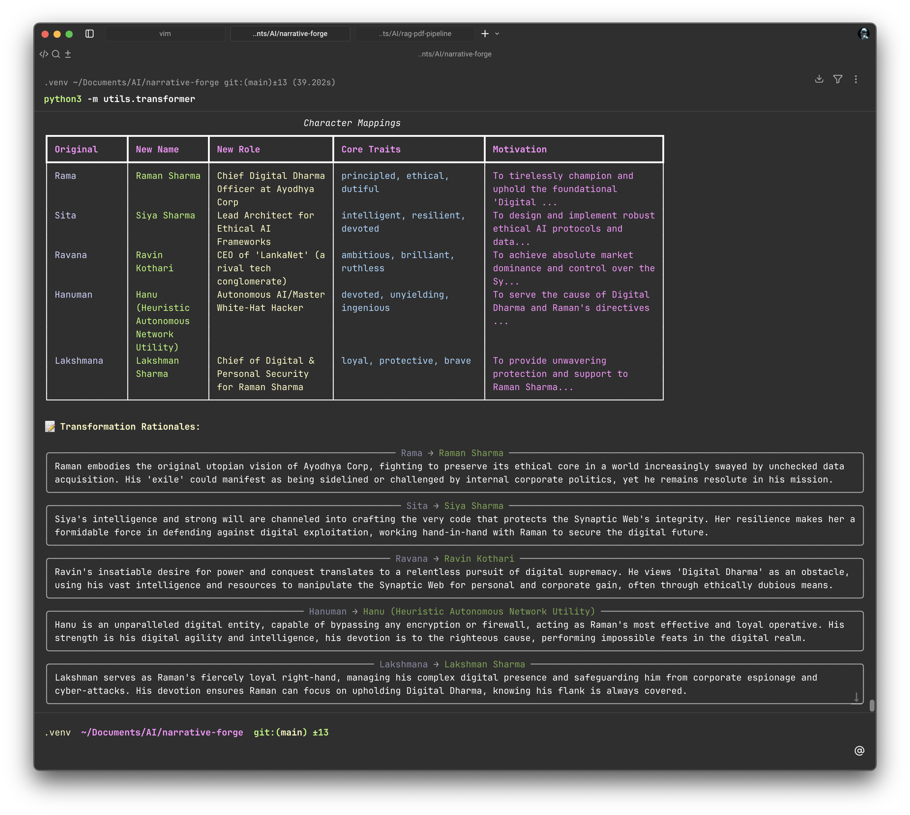

# 🎬 NarrativeForge

> Reimagining timeless stories across infinite worlds

An AI-powered system that transforms classic narratives into new settings while preserving their emotional and thematic essence.


## 🚀 Quick Start

### Prerequisites

- Python 3.10+
- uv package manager
- Google Gemini API key

### Installation

```bash
# Clone/navigate to project
cd narrative-forge

# Install dependencies
uv sync

# Setup environment
cp .env.example .env
# Add your GOOGLE_API_KEY to .env
```

### Usage

```bash
# Run complete transformation pipeline
uv run main.py

# Output will be generated in output/reimagined_story.md other files are drafts
```

### Also try below to see application working

```bash
python3 -m utils.transformer
```

## 📁 Project Structure

```
narrative-forge/
├── run.py                  # does nothing -- will clean the codebase
├── utils/
│   ├── extractor.py        # Story element extraction
│   ├── transformer.py      # Character & plot transformation
│   ├── validator.py        # Consistency checking
│   └── assembler.py        # Output assembly  <-- use this function to generate defined story
├── prompts/                # LLM prompt templates
├── data/                   # Source story metadata
├── output/                 # Generated stories
│   └── reimagined_story.md # <- look for this file
└── docs/                   # Solution documentation
```

## 🎯 Features

- ✅ Modular prompt engineering pipeline
- ✅ Structured character mapping
- ✅ Theme preservation validation
- ✅ Reproducible story generation
- ✅ Consistency checking across outputs

## 📝 Example Transformation

**Source:** Ramayana (Indian Epic)  
**Target:** Silicon Valley Tech Startup  
**Output:** The Silicon Exile - A tale of corporate ethics, loyalty, and redemption

---

Built for Pratilipi AI Engineer Take-Home Assignment
